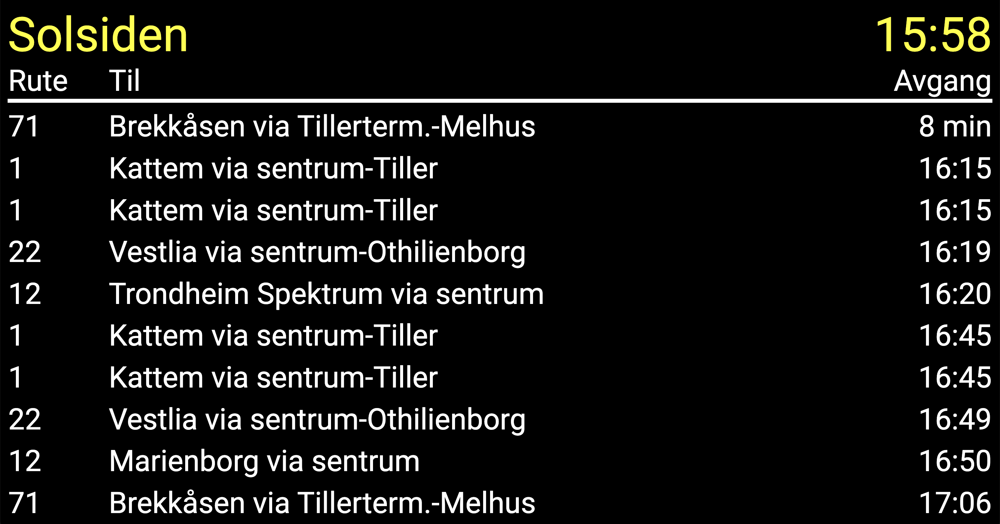

# ATB Information Display Clone
This project is an attempt to recreate the displays at ATB bus-stops which show the current bus arrivals using the public and realtime ATB/Entur API. The project is hosted at https://jotjern.github.io/AtB-information-display-clone/ or can be run locally using `npm run dev`.

## Screenshot of application
